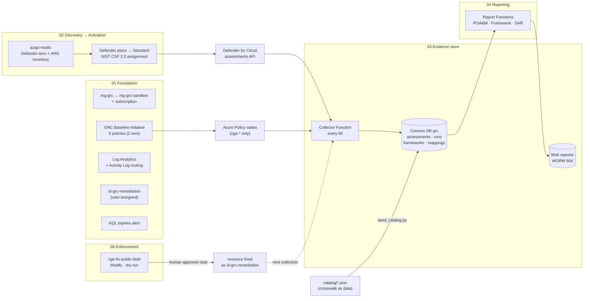
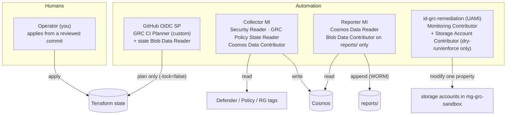

# Architecture

How the pipeline is put together: which stage runs where, which identity may do what,
and how a single Defender finding travels from the platform to an immutable report
and back into a fix. Read this after the [README](../README.md). It explains why the
code in `stages/` is shaped the way it is.

## 1. Stage flow

| Stage | Root module | State key | Consumes (via `terraform_remote_state`) | Produces (outputs = the contract) |
|---|---|---|---|---|
| 01 Foundation | `stages/01-foundation` | `01-foundation.tfstate` | nothing | MG id, workspace id, evidence RG, remediation identity, baseline assignment id |
| 02 Activation | `stages/02-activation` | `02-activation.tfstate` | nothing (discovers live) | `inventory`, `current_plan_tiers`, `activation_needed` (gap map), `plan_coverage` |
| 03 Evidence store | `stages/03-evidence-store` | `03-evidence-store.tfstate` | 01 | Cosmos endpoint/id, evidence account, collector app + principal, App Insights |
| 04 Reporting | `stages/04-reporting` | `04-reporting.tfstate` | 01, 03 | reporting app + principal |
| 06 Enforcement | `stages/06-enforcement` | `06-enforcement.tfstate` | 01 | `remediation_mode`, `remediation_assignment_id` |

Each stage keeps its own state, so a bad apply in reporting can't corrupt the
foundation. Stages talk only through outputs, never through each other's resources.
Stage 5 (the AI narrative digest) is optional in the rubric and not built. See
[DECISIONS.md](DECISIONS.md#d9-no-stage-5-narrative).

### Discovery before activation (stage 02)

Stage 02 reads before it writes. `data.azapi_resource.pricing` reads the current tier
of every baseline Defender plan (azurerm has no data source for it: F12).
`data.azapi_resource_action.inventory` runs a Resource Graph query that counts
resources by type. The outputs are the typed inventory plus the gap map. The
activation resources are keyed on the **baseline**, not on the gap. Keying on the gap
makes Terraform destroy the plan it has just enabled on the next run
([VALIDATION-LOG F13](VALIDATION-LOG.md)). A plan that is already on Standard
converges with no change, and plans outside the baseline are never touched.

## 2. Identity boundaries

| Identity | Type | Roles (scope) | Can | Cannot |
|---|---|---|---|---|
| Operator | Entra user | Owner (sub) · Blob Data Contributor (state RG, evidence account) · Cosmos Data Contributor (evidence account) | apply stages, seed the catalog, run the proofs | overwrite or delete WORM reports (the platform refuses) |
| CI planner | Entra SP, OIDC federated to `fdicarlo/cgeaz` (main + pull_request) | **GRC CI Planner** custom role (mg-grc): `*/read` + list-keys/config actions · Storage Blob Data **Reader** (state RG) | `terraform plan`, KQL queries, open issues | write anything in Azure, take a state lease |
| Collector | system-assigned MI (`func-grc-collectors-*`) | Security Reader (sub) · GRC Policy State Reader (sub, custom, 2 actions) · Cosmos Built-in Data Contributor (evidence account) | read posture, write evidence | change anything it observes, write reports |
| Reporter | system-assigned MI (`func-grc-reporting-*`) | Cosmos Built-in Data **Reader** (evidence account) · Storage Blob Data Contributor (**`reports` container only**) | read the store, add report artifacts | reach any live platform API, write evidence, alter a stored report (WORM) |
| Remediation | user-assigned MI `id-grc-remediation-dev` | Monitoring Contributor (mg-grc-sandbox) · Storage Account Contributor (mg-grc-sandbox, **only when `remediation_mode` ≠ audit**) | deploy diagnostic settings (DINE), flip `allowBlobPublicAccess` (Modify) | read data, delete resources, grant access |

Why each boundary exists:

- **Collector vs reporter (SoD by role scope).** The identity that records the facts
  cannot write the narrative, and the narrative identity can't reach a live API. The
  Cosmos-only rule for reports is therefore enforced by RBAC, not left as a code
  convention.
- **One named remediation identity.** Every automated fix in the sandbox has the same
  author. Filter the Activity Log by this caller (saved search
  `grc-remediation-history`) and you have the full history of automated change. It
  gets the storage role only while the escalation ladder allows remediation.
- **Plan-only CI.** The upstream lab gives CI Contributor at mg-grc. Here CI can read
  everything a plan needs and write nothing, so a compromised workflow can't change
  the sandbox. Applies stay a human act (see [DECISIONS.md](DECISIONS.md#d4-plan-only-ci-identity)).
- **Zero stored credentials.** Managed identities run inside Azure, and GitHub gets
  short-lived OIDC tokens. Cosmos local auth and shared keys on the evidence account
  are off. The one exception is Functions runtime storage
  ([EXCEPTIONS.md EXC-01](EXCEPTIONS.md#exc-01)).

## 3. Evidence data model (Cosmos `grc`)

| Container | Partition key | One document per | Written by | Key fields |
|---|---|---|---|---|
| `assessments` | `/subscriptionId` | finding **per run** (append-only) | collector | `id`=hash(findingKey+runId), `findingKey`, `source` (`defender`/`azure-policy`), `assessmentId`, `status`, `severity`, `categories`, `resourceId`, `resourceGroup`, `owner`, `firstSeenAt`, `statusChangedAt`, `previousStatus`, **`runId`**, **`collectedAt`** |
| `runs` | `/subscriptionId` | collection sweep | collector (last write of a run) | `runId`, `collectedAt`, `trigger` (timer/http), `written`, `counts`, `errors`, `durationMs` |
| `frameworks` | `/frameworkId` | framework | seed_catalog.py (operator) | `controls` {id: name}, `catalogVersion` |
| `mappings` | `/frameworkId` | crosswalk rule × framework | seed_catalog.py (operator) | `match` {source, assessmentId \| category}, `controls`, `title`, `severity` |

Why the assessments container is append-only: a report pinned to run *X* can be rebuilt
at any later date with `SELECT * FROM c WHERE c.runId = 'X'`. If documents were
overwritten on every sweep, last week's SAR would no longer match the store. Retrying a
run writes the same IDs again, so collection stays idempotent.

## 4. One finding, end to end

1. **Defender** evaluates a storage account and marks the assessment "Storage accounts
   should prevent shared key access" Unhealthy.
2. The **collector** (every 6h) reads it with Security Reader, looks up the resource
   group's `owner` tag, carries `firstSeenAt` forward from the previous run, and writes
   `assessments/<hash>` stamped with `runId` and `collectedAt`. It writes the `runs`
   ledger entry last.
3. The **reporter** (06:15 UTC) pins to the newest ledger entry. It crosswalks the
   finding through `mappings` (category `Data` → CSF PR.DS, 800-53 SC-28/SC-8) and
   writes `poam/YYYY/MM/poam-…json|xlsx` into the WORM container. The due date is
   `firstSeenAt` + the SLA, and the line item carries its own `traceQuery`.
4. **The auditor's test:** `scripts/trace.py` downloads the newest POA&M from WORM,
   runs the item's `traceQuery`, and compares the report against the store field by
   field. It then recomputes the SAR's headline numbers from its embedded queries.
5. **Fix and loop:** if the finding is covered by an enforcement policy, a human
   approves the remediation task. The next collection shows it Healthy, and the next
   POA&M drops the line. Nobody edits a document.

## 5. Operations: the three watchers

| Question | Mechanism | Where | Cadence |
|---|---|---|---|
| Does reality match code? | `terraform plan -detailed-exitcode` per stage | `.github/workflows/drift.yml` → `drift` issue | nightly 08:00 UTC |
| Who is touching reality? | KQL over `AzureActivity`, callers outside the trusted list | Azure Monitor alert `alert-grc-out-of-band-change` (hourly) + drift.yml (nightly issue) | hourly + nightly |
| Is the pipeline alive? | `AppRequests` for collector/report functions in the last 25h | drift.yml → `pipeline-health` issue; saved search `grc-pipeline-run-history` | nightly |
| Is a change allowed to merge? | conftest on the plan JSON + Tier 0 | `.github/workflows/gate.yml` (required checks on `main`) | every PR |
